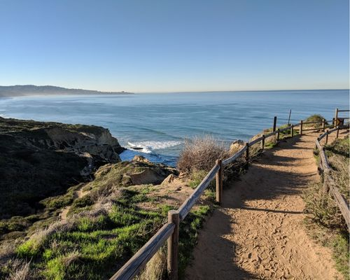
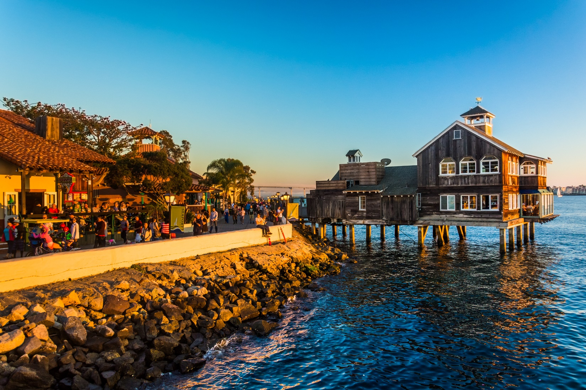

# Welcome to Jonathan Ty's User Page

Nice to meet you, my name is **Jonathan Ty**. I am a second-year Computer Science student attending the [University of California, San Diego](https://ucsd.edu/). Below, you can find more information regarding any *hobbies*/*interests*, *education*, *experience*, *technical skills*, and *fun facts*! 

## Table of Contents
💬 [Favorite Quote](#favorite-quote)\
👟 [Hobbies and Interests](#hobbies-and-interests)\
💪 [Technical Skills](#technical-skills)\
😊 [Fun Facts](#fun-facts)\
👁️ [Social Media](#social-media)

## Favorite Quote
Throughout my **twenty years** on this planet, I've had the privilege of being literate and understand the sheer impact speech and written language can have on individuals and society. The best and brightest of human society have uttered words I probably wouldn't be able to think of. Among these geniuses, here's my favorite quote from one of them.
> "People must learn to hate and if they can learn to hate, they can taught to love." - [Nelson Mandela](https://www.nelsonmandela.org/biography)

## Hobbies and Interests
- Running 👟
  - I go on runs at [Torrey Pines State Natural Reserve](https://torreypine.org/) with friends every week! A lofty goal of mine is to run all the way to [Oceanside](https://www.ci.oceanside.ca.us/)!
- Movies 🍿
  - While I haven't gone to the movies in a while, I used to go to the movie theatres almost every week watching a wide range of films ranging from horror to comedy, from indie films to summer blockbusters!
  - This hobby of mine became a hobby only because I had an AMC Stubs Membership, a monthly subscription, that lets you watch three free movies a week
- Board Games ♟️
  - I really love playing board games with my friends whenever we have the time! 
  - I have many board games such as Monopoly Deal, Scattergories, Codenames, Don't Say "Um", Moose Master, One Night Werewolf, etc.

## Technical Skills
**Languages**
- Python
- HTML/CSS
- JavaScript
- C++

**Developer Tools**
- Visual Studio
- GitHub
- Git
- Figma

## Fun Facts
The first line of code I ever typed out was during my junior year of high school when I was taking AP Computer Science Principles.
```
System.in.println("Hello world!")
```

### Top 5 Places in San Diego that I want to visit
If it's checked, this means that I visited it already!
1. - [X] [Torrey Pines State Natural Reserve](https://torreypine.org/)



2. - [X] [Balboa Park](https://balboapark.org/)


3. - [X] [Mission Beach](https://www.sandiego.org/explore/things-to-do/beaches-bays/mission-beach.aspx)


4. - [X] [Seaport Village](https://www.seaportvillage.com/)



5. - [X] [Del Mar Fairgrounds](https://www.delmarfairgrounds.com/)


## Social Media
[Markdown File with Social Media Info](social-media.md)


